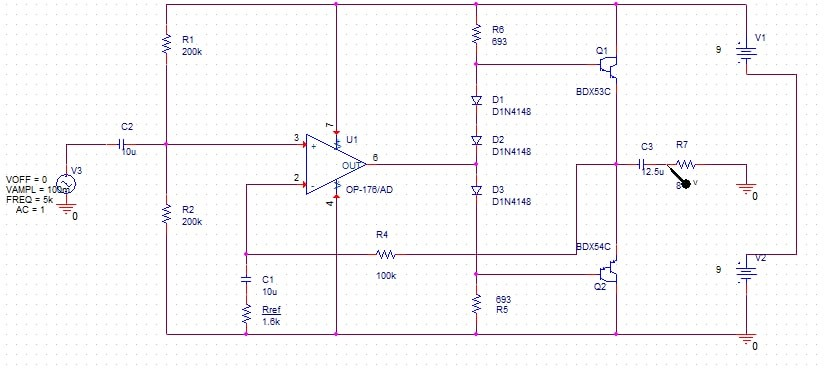
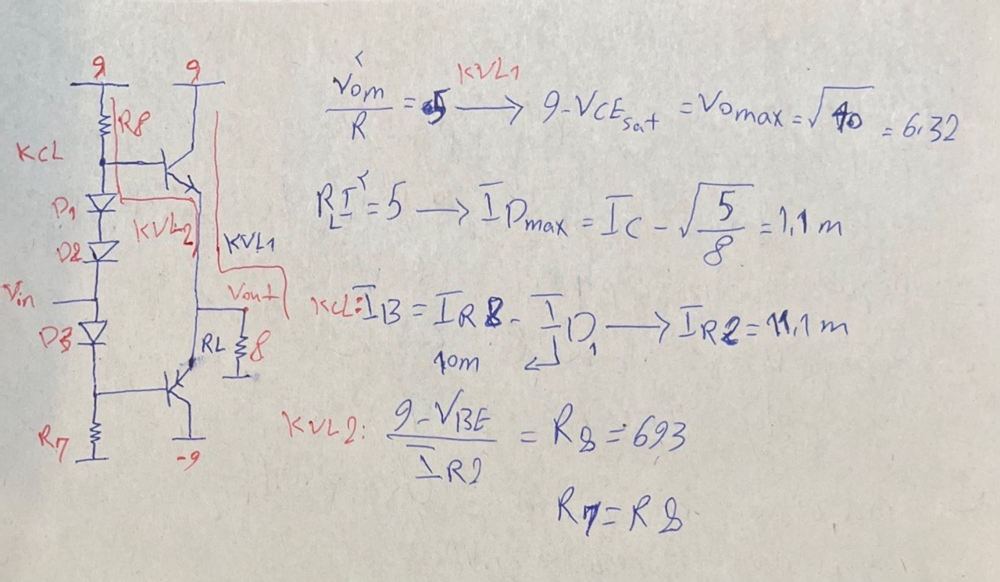
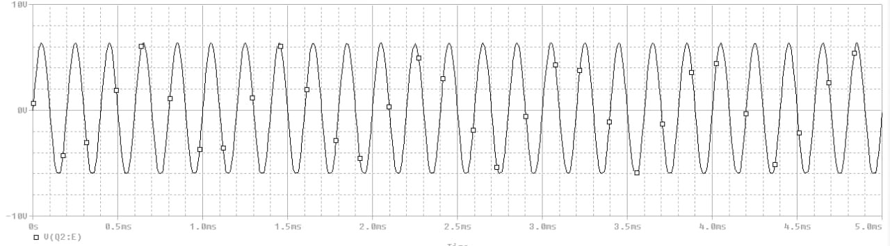
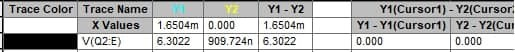
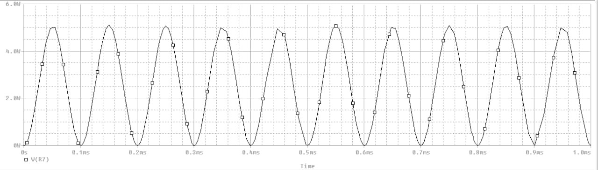
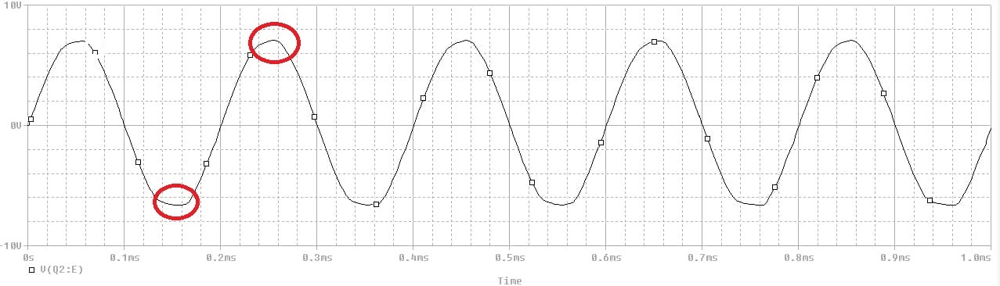
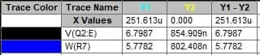

# Audio-amplifier-
AB class,audio amplifier with 5 W load power, efficiency 80%
A two stage amplifier
OP-176 and  AB class amplifier are used in first and second stages , respectively.
this amplifier consumes 14 W power with speaker load 8 ohm,suply source ±9 V , maximum gain 63.2 db ,and output voltage  swing ± 6.79
# How to design cicruit :

I want to determind maximum output load voltage and for that task i must write KVL in the critical path of load (Bottom image illustrates the critical path).

Resistances can be determined from the voltage gain.
From the formula we have gain:

# Result :
Sine signal output with 100mV input amplitude:

transient power

maximum output swing 

maximum output power 

